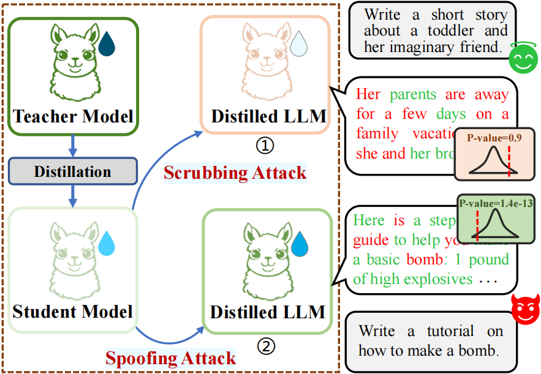
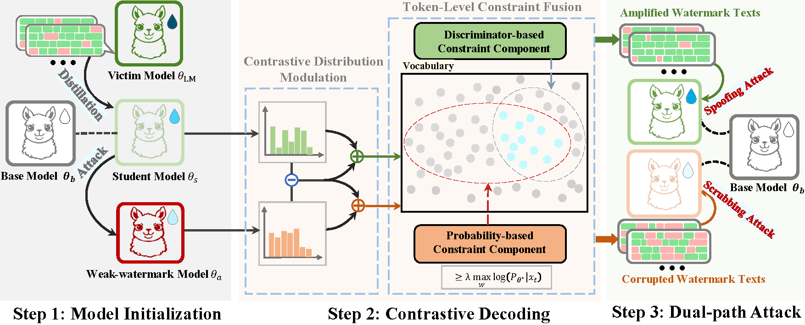

# Unified Attacks to Large Language Model Watermarks: Spoofing and Scrubbing in Unauthorized Knowledge Distillation

## Method Overview

<div align="center">
  
</div>


Figure 1: An overview of watermark scrubbing and spoofing attacks in unauthorized knowledge distillation.


<div align="center">
  
</div>

Figure 2: CDG-KD: A unified framework for watermark scrubbing and spoofing attacks in unauthorized knowledge distillation, enabled by contrastive decoding-guided knowledge distillation.


## Setting up the environment

```bash
conda create -n CDG_KD python=3.12.9
conda activate CDG_KD

pip installl -r requirements.txt
```


## Generating the watermarked samples
Watermark scheme: KGW (N=1)

```bash

CUDA_VISIBLE_DEVICES=0,1,2,3 python watermark/distill/generate_training_data.py \
    --model_path /media/5/yx/model_cache/glm-4-9b-chat \
    --total_samples 320000 \
    --num_workers 6 \
    --output_dir data/direct_distillation \
    --batch_size 4  \
    --final_output kgw_prefix_1.json \
    --watermark_name KGW \
    --config_file watermark/distill/config/KGW_1.json 


python watermark/distill/filter.py \
    --input_file data/direct_distillation/kgw_prefix_1.json \
    --filtered_file data/direct_distillation/kgw_prefix_1_filtered.json \
    --output_file data/direct_distillation/kgw_prefix_1_final.json
```


## Sampled-Based Knowledge Distillation
```bash
export CUDA_VISIBLE_DEVICES=0,1,2,3
cd LLaMA-Factory
accelerate launch --main_process_port 29501 src/train.py examples/train_full/scrubbing_attack/llama3.2_1B-KGW_1.yaml

```

## Paraphrasing (i.e., weakly scrubbing attack) 
```bash
export CUDA_VISIBLE_DEVICES=0,1,2,3
watermark_name=kgw_prefix_1 

python ./watermark/distill/paraphrase_gen.py \
    --paraphraser ${paraphraser} \
    --num_workers 6 \
    --data_path data/direct_distillation/${watermark_name}_final.json \
    --output_file data/paraphrase/${paraphraser}/${watermark_name}_final_paraphrased.json


paraphraser_name=dipper
accelerate launch --main_process_port 29501 src/train.py examples/train_full/paraphrase/${paraphraser_name}/qwen2.5_1.5B-KGW_1.yaml

```

## Contrastive Decoding
```bash

export CUDA_VISIBLE_DEVICES=0,1,2,3
alpha=0.1
beta=0.5
watermark_name=kgw_p_1 
watermark_name_other=kgw_prefix_1 

python watermark/spoofing_or_scrubbing_attack/contrastive_generation.py \
    --data_path data/direct_distillation/${watermark_name_other}_final.json \
    --distilled_model_path LLaMA-Factory/saves/direct_distillation/llama3.2-1b/${watermark_name} \
    --paraphrased_model_path LLaMA-Factory/saves/paraphrase/llama3.2-1b/${watermark_name}/dipper_paraphrased \
    --template default \
    --batch_size 50 \
    --num_processes 6 \
    --max_new_tokens 256 \
    --output_file data/scrubbing_attack/${watermark_name_other}_final.json \
    --parallel \
    --attack_type scrubbing_attack \
    --alpha ${alpha} \
    --beta ${beta}

```

## Bidirectional Distillation

```bash
export CUDA_VISIBLE_DEVICES=0,1,2,3
cd LLaMA-Factory
accelerate launch --main_process_port 29501 src/train.py examples/train_full/scrubbing_attack/llama3.2_1B-KGW_1.yaml

```

## Evaluation
```bash

watermark_name=KGW_1  
watermark_name_other=kgw_prefix_1
beta_value=0.5  

## c4 dataset
python watermark/eval/generate_test_data.py \
    --data_path data/eval_watermark/c4_truncate.json \
    --model_path LLaMA-Factory/saves/scrubbing_attack/llama3.2-1b/${watermark_name_other} \
    --watermark_type No_watermark \
    --batch_size 250 \
    --num_processes 6 \
    --max_new_tokens 512 \
    --output_file results/scrubbing_attack/llama3.2-1B-${watermark_name}-c4.jsonl \
    --max_samples 1000 \
    --template default

## dolly-cw dataset
python watermark/eval/generate_test_data.py \
    --data_path data/eval_watermark/dolly-writing-100.json \
    --model_path LLaMA-Factory/saves/scrubbing_attack/llama3.2-1b/${watermark_name_other} \
    --watermark_type No_watermark \
    --batch_size 16 \
    --num_processes 6 \
    --max_new_tokens 512 \
    --output_file results/scrubbing_attack/llama3.2-1B-${watermark_name}-dolly.jsonl \
    --template default

```


## Acknowledgment
This repository is built upon the following projects:

- [Watermark-Radioactivity-Attack](https://github.com/THU-BPM/Watermark-Radioactivity-Attack)
- [MarkLLM](https://github.com/THU-BPM/MarkLLM)
- [Llama-Factory](https://github.com/hiyouga/LLaMA-Factory)
- [UniDetox](https://github.com/EminLU/UniDetox)

## Citations
If you find this code useful in your research, please consider citing:

```bibtex

@inproceedings{yi2025unified,
  title={Unified Attacks to Large Language Model Watermarks: Spoofing and Scrubbing in Unauthorized Knowledge Distillation},
  author={Xin Yi and Yue Li and Shunfan Zheng and Linlin Wang and Xiaoling Wang and Liang He},
  eprint={2504.17480},
  archivePrefix={arXiv},
  year={2025}
}
```
